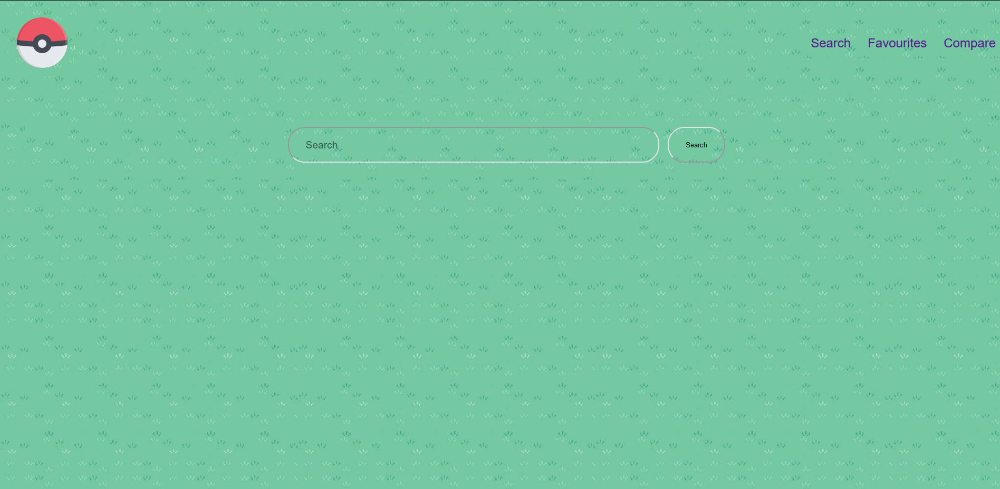
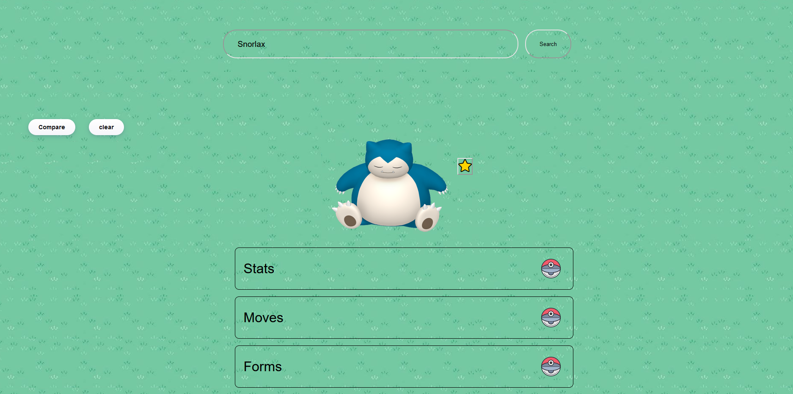
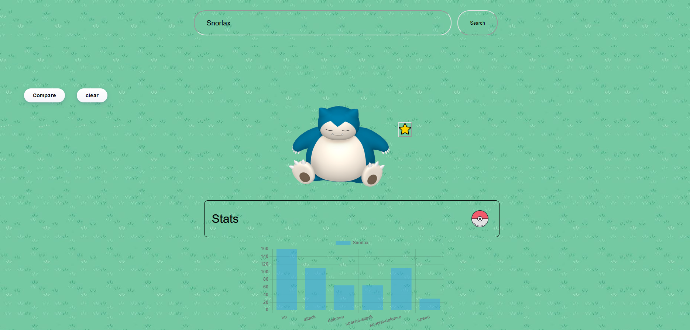
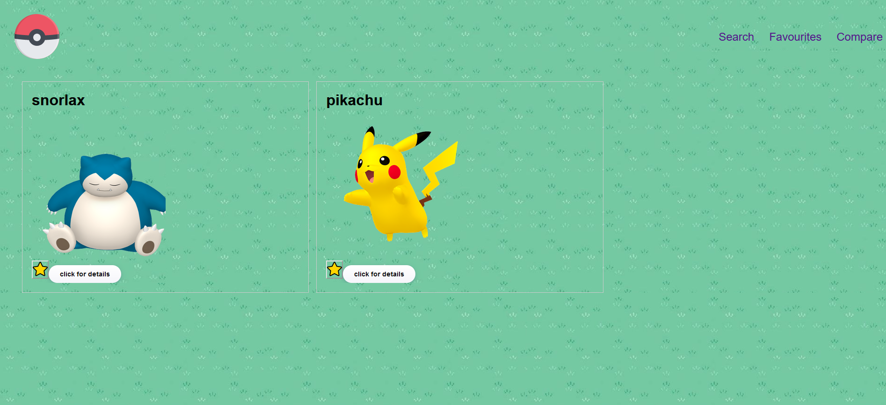
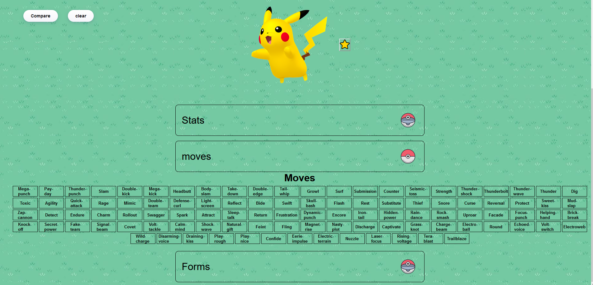
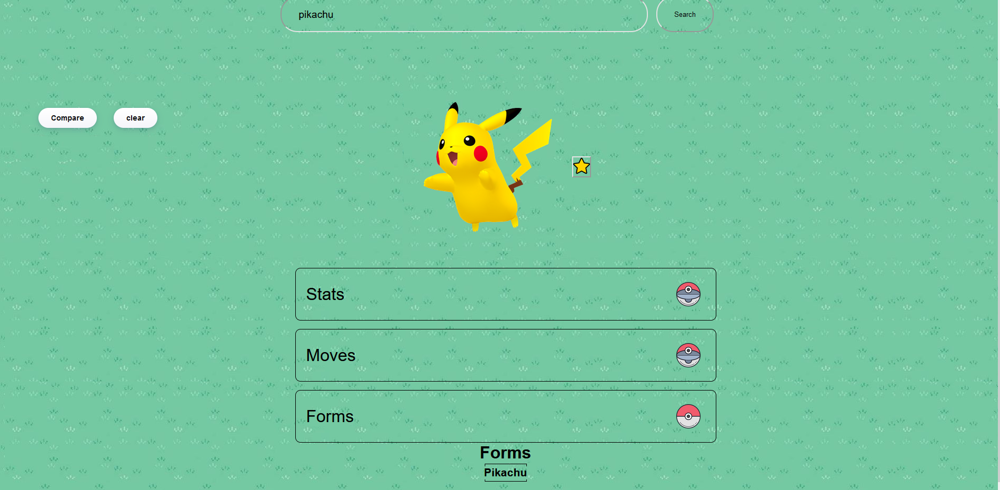
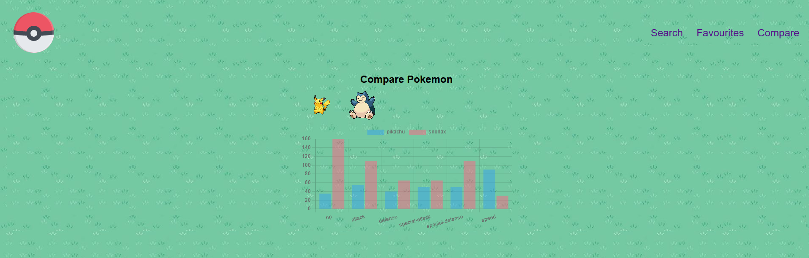

# pokedex-2.0

## About the project

This project is an Directory for finding details for any Pokemons.

## A tour of the site
### Live demo of the website https://pokedex2-0.netlify.app/

1. #### Landing Page

   

2. #### Search Page
   This the search Page

2. #### Stats
   click on the stats panel to toogle Stats.

6. #### Favourite Page
   This is the page where Pokemons marked as favourite Show up .

7. #### Moves

   toggle to see moves
   

8. #### Forms

   toogle to see forms
   

9. #### Compare Page
   this page shows and compare stats for pokemons added in the compare list
   

## Tech stack used

    React.js

## How to Run?

1. clone the github repository.
2. install node.js.
3. cd into Pokedex-2.0.
4. run command `npm i` to install all the depedencies.
5. run commmand `npm run dev` to start react app
